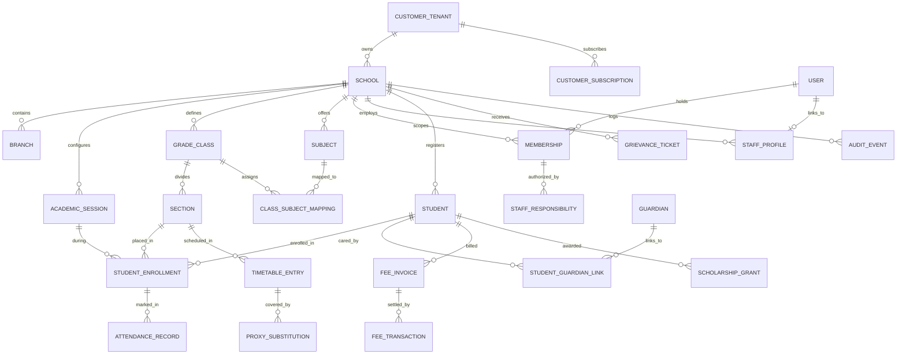

# VidyaFloww — Core Enterprise Entity-Relationship Diagram (ERD)

```mermaid
erDiagram
    CUSTOMER_TENANT ||--o{ SCHOOL : owns
    CUSTOMER_TENANT ||--o{ CUSTOMER_SUBSCRIPTION : subscribes
    SCHOOL ||--o{ BRANCH : contains
    SCHOOL ||--o{ ACADEMIC_SESSION : configures
    SCHOOL ||--o{ GRADE_CLASS : defines
    GRADE_CLASS ||--o{ SECTION : divides
    SCHOOL ||--o{ SUBJECT : offers
    GRADE_CLASS ||--o{ CLASS_SUBJECT_MAPPING : assigns
    SUBJECT ||--o{ CLASS_SUBJECT_MAPPING : mapped_to

    USER ||--o{ MEMBERSHIP : holds
    SCHOOL ||--o{ MEMBERSHIP : scopes
    MEMBERSHIP ||--o{ STAFF_RESPONSIBILITY : authorized_by

    SCHOOL ||--o{ STAFF_PROFILE : employs
    USER ||--o| STAFF_PROFILE : links_to

    SCHOOL ||--o{ STUDENT : registers
    STUDENT ||--o{ STUDENT_ENROLLMENT : enrolled_in
    ACADEMIC_SESSION ||--o{ STUDENT_ENROLLMENT : during
    SECTION ||--o{ STUDENT_ENROLLMENT : placed_in
    STUDENT ||--o{ STUDENT_GUARDIAN_LINK : cared_by
    GUARDIAN ||--o{ STUDENT_GUARDIAN_LINK : links_to

    STUDENT_ENROLLMENT ||--o{ ATTENDANCE_RECORD : marked_in
    SECTION ||--o{ TIMETABLE_ENTRY : scheduled_in
    TIMETABLE_ENTRY ||--o{ PROXY_SUBSTITUTION : covered_by

    STUDENT ||--o{ FEE_INVOICE : billed
    FEE_INVOICE ||--o{ FEE_TRANSACTION : settled_by
    STUDENT ||--o{ SCHOLARSHIP_GRANT : awarded

    SCHOOL ||--o{ GRIEVANCE_TICKET : receives
    SCHOOL ||--o{ AUDIT_EVENT : logs
```

> Full domain-specific ER diagrams live inside each domain LLD in `docs/architecture/LLD/`.
